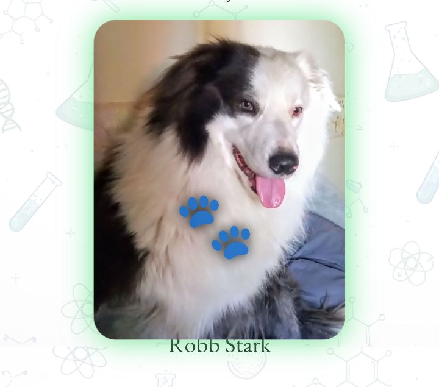

# Trabajo Práctico Grupal 1 - Proyecto Web en Equipo
**Grupo:** DeveloPET Friendly - Grupo 4 Com. D  
**Materia:** Proyecto Web  
**Institución:** IFTS N.°29  

**Enlace al Proyecto Desplegado (Vercel):** [https://tp1frontend.vercel.app/]

## Descripción del Proyecto
Este proyecto es una presentación web colaborativa desarrollada por el equipo "DeveloPET Friendly". El objetivo principal fue crear una portada grupal que integre los perfiles profesionales de cada integrante, manteniendo una estructura de navegación coherente, diseño adaptable (Responsive Design) mediante CSS Grid, y aplicando buenas prácticas de organización de archivos. Se incluye además una sección de Bitácora para documentar las decisiones de diseño y las herramientas utilizadas durante el proceso.

## Integrantes
- Verónica Greco - [LINK](https://tp1frontend.vercel.app/veronica.html)
- Mailén - [LINK](https://tp1frontend.vercel.app/mailen.html)
- Braian Perea - [LINK](https://tp1frontend.vercel.app/braian.html)
- Guillermo - [LINK](https://tp1frontend.vercel.app/guillermo.html)
  
## Tecnologías Utilizadas
- HTML5 (Semántica estructural)
- CSS3 (Variables nativas, CSS Grid y Flexbox)
- JavaScript Vanilla (Interactividad DOM y Modal Lightbox)
- Google Fonts

## Estructura de Archivos
Se respetó el requisito de mantener los archivos HTML en la raíz, separando lógica, estilos y recursos multimedia en subcarpetas:
- `index.html` (Portada principal).
- `bitacora.html` (Registro de desarrollo).
- `veronica.html`, `mailen.html`, `braian.html`, `guillermo.html` (Páginas individuales).
- `/css` - Contiene la hoja de estilos global unificada (`styles.css`).
- `/js` - Contiene los scripts con la lógica dinámica de la portada y los perfiles.
- `/img` - Almacena las fotos de perfil, capturas de proyectos y portadas de discos.

## Guía de Estilos
- **Paleta de Colores (Basada en Variables CSS):**
  - Fondo Principal: `#f9f9f9`
  - Texto Principal: `#333333`
  - Header y Navbar: `#2c3e50` (Azul Oscuro elegante)
  - Botones y Acentos: `#3498db` (Azul Claro)
  - Elementos de contraste (Portafolio): `#e74c3c` (Rojo acento)
  - *Modo Oscuro:* Fondos en `#121212` y `#1e1e1e` con textos en `#e0e0e0`.
- **Tipografías:**
  - `Poppins` (Principal, elegante y redondeada): [Google Fonts - Poppins](https://fonts.google.com/specimen/Poppins)
  - `Roboto` (Fallback y lectura fluida): [Google Fonts - Roboto](https://fonts.google.com/specimen/Roboto)
  - `Ubuntu` (Principal, moderna, limpia y muy legible): https://fonts.google.com/specimen/Ubuntu
  - `Delius` (Amigable, manuscrita y relajada, ideal para un estilo cálido y cercano): https://fonts.google.com/specimen/Delius
  - `EB Garamond` (Elegante, clásica y sofisticada, ideal para textos con estilo editorial): https://fonts.google.com/specimen/EB+Garamond
- **Privacidad y Avatares:** Se utilizaron avatares ilustrativos y fotos representativas de mascotas/hobbies para preservar la identidad personal en un repositorio público, tal como lo sugiere la consigna.

## JavaScript y Funcionalidades Dinámicas
Se implementaron funciones en JavaScript puro para mejorar la experiencia de usuario y cumplir con el requisito de interactividad.

- **Función en Portada (`index.html` y `bitacora.html`):** Implementamos un "Modo Oscuro" (Dark Mode) global. Al hacer clic en el botón de la cabecera, una función de JS intercala una clase `.dark-mode` en la etiqueta `<body>`, modificando instantáneamente el fondo, los textos y el color de las tarjetas a través de selectores CSS específicos.

>**Capturas de pantalla: 

- **Función en veronica.html:** En la sección **Mi Manada**, se implementó una funcionalidad con JS que permite, al hacer clic sobre las imágenes de las mascotas, ampliar la fotografía seleccionada, modificar su borde visualmente y activar una animación decorativa de una patita que aparece desde el punto del clic.

>**Capturas de pantalla:

## Uso de Inteligencia Artificial (IA)
- **Herramientas utilizadas:** Google Gemini. NotebookLM
- **Uso en Contenido y Código:** - **Refactorización CSS:** Se utilizó IA para analizar hojas de estilo distintas (a raíz de la unificación de perfiles) y unificarlas en un único archivo `styles.css`. La IA ayudó a identificar clases duplicadas, agrupar selectores de variables globales y estandarizar el diseño responsivo (Breakpoints de 900px y 1200px requeridos por el TP).
  - **Lógica JavaScript:** Gemini asistió en la creación de la lógica para el Modal Lightbox, sugiriendo la mejor forma de iterar sobre una colección de imágenes con `querySelectorAll` y aplicar *Event Listeners* sin necesidad de usar librerías externas.
- **Generación de Imágenes:** *[Se utilizó Gemini PRO para la generación de los avatares de los perfiles]*.
